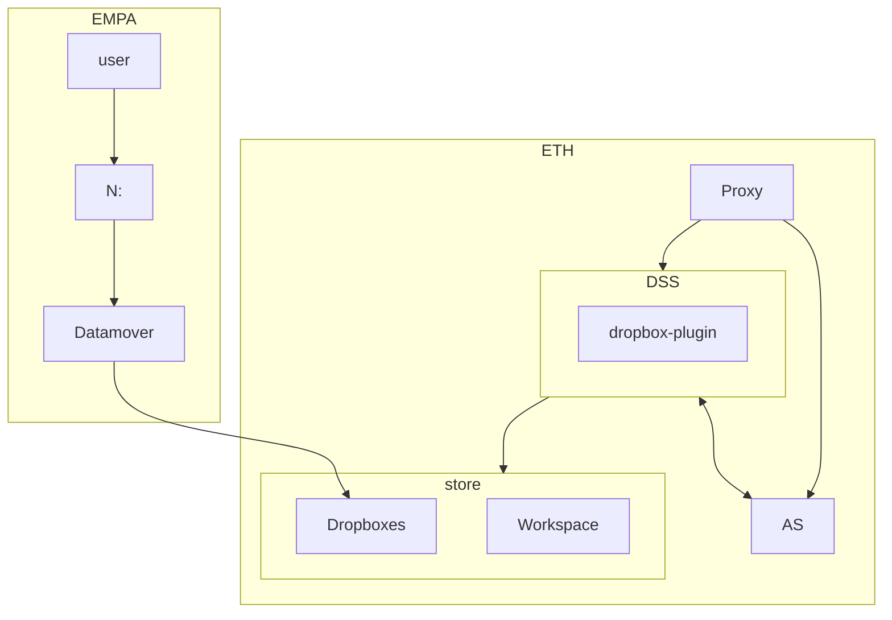
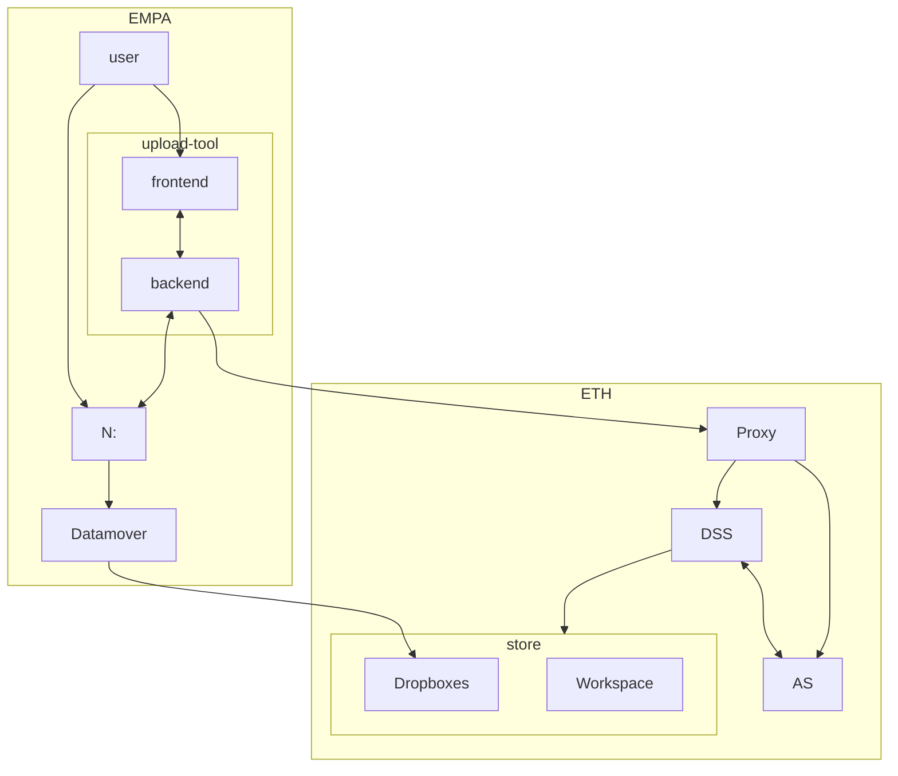

# OpenBIS Uploader / Dataset ingestion tool

## Introduction
Proof of concept of an openBIS dataset ingestion tool / webapp with self-service functionalities and a better UI

The system is meant to replace the current dropbox solution offered by ETH, which requires developer to write Jython/Java core plugins that are deployed on the openBIS instance server.

To trigger the scripts, users (or instruments) upload a file in the staging area in their `N:` shares. Afterwards, the datamover scripts transfers the data to the openBIS instance in the datastore storage. When the transfer finishes, the dropbox plugin starts, which takes care of ingesting the data into openBIS.
The plugin can do anything the programmer desires, including adding new samples, collection and dataset to the instance. This is useful for example when a number of objects should be extracted from a data file automatically.

 For more information on this concept, please refer to the openBIS documentation [here](https://unlimited.ethz.ch/display/openBISDoc2010/Dropboxes)

While this is the officially supported solution to import large data into openBIS, it has the disadvantage that only ETH SIS can approve and deploy new plugin, making the devleopment cycle slower and increasing the coupling.

To replace this solution, we designed an web-based system which works according to a similar principle but does not require to deploy  core plugins. With this solution, any users / instance admin can develop, test and deploy new dataset ingestion scripts which do not need to be approved by ETH SIS.


## Architecture

### General idea
This tool consists of two parts:
- A backend written in python.
- A webapp written in Typescript using the vue.js framework.

The backend is meant to run on a server (later it will be probabily hosted by EMPA ICT) and takes care of the following  features:

- User authentication against their openBIS instance
- Listing and retreiving files from the user `N:` shares
- Getting information on the openBIS instance, including the tree view
- Importing and attaching new dataset ingestion scripts
- Triggering a dataset ingestion
- Inspecting the status of the ingestion jobs


The frontend should also be served by a webserver, it allows the user to interact with the above functionalities in an easy manner.


### Concept drawing

#### Traditional Jython dropbox

The following diagram shows the architecture of the current Jython/Java data ingestion solution as supported by ETH SIS:



The users / the device place data in the `N:` folder; the datamover script transfers it to the ETH DSS store in the dropbox landing area. When a new dataset is detected, the corresponding dropbox plugin is triggered. This plugin receives the datasets to be attached as well as an OpenbisBIS transaction. Using these inputs, the plugin can create new openbis samples, attach medatata, attach the ingested metadata etc. When the work is done, the transaction is commited. By operating inside of a transaction, the work is atomic: if anything during the processing goes wrong, the entire transaction is rolled back leaving the instance clean.


This solution works very well, however it suffers from two fundamental problems:

- The plugins must be written in Jython 2.7 or in Java. The first option is not very appealing since it doesn't support the newer features of python and does not offer most of the powerful modern python packages. The latter option is not accessible but for a few professional software developers.

- ETH SIS must approve and deploy the plugin on the OpenbisBIS datastore server. This makes the development and testing process slower and increases the level of coupling between ETH and EMPA. 

We want to replace this with a more self-service solution, where ideally any user inse Empa can write a dataset ingestion plugin by simply implementing a python function.


#### New User-defined dropbox
The diagram below shows architecture of the new solution, which side-steps the dropox plugin, which needs to be installed directly in the OpenbisBIS DSS 



The concept is similar to the previous generation of dropbox plugins, whith the difference that the python plugin runs in the backend server at EMPA; through the frontend app users can configure and register new plugin and monitor their progress.

The idealised workflow is a follows:


### Services
The tool is built upon a series of services, deployed as docker containers (the names given below  in **boldface** correspond to the names in the docker compose file [here](docker-compose.yml)). In most cases, the configuration / source code of the services is mounted to their corresponding directory using a bind mount, so that interactive development from outside the container is possible easily. For the location of the bind mounts, look at the corresponding `volumes` section for each service.

- **openbis** 

    This service provides a pre-configured openbis instance whith ldap login configured; the authentication is made using the **ldap** service.   This is defined throught [`service.properties`](./services/openbis/service.properties) and [`groups.json`](./services/openbis/groups.json) 

    The instance is populated at runtime with default object and structures by the **openbs-initialiser** ephermeral service. The instance configuration is in [`instance.json`](./services/openbis-initialiser/config/instance.json)

- **data-discovery**

    This service provides the REST API which acts as the sole entrypoint for all operations on the file staging area, the dataset ingestion and the communication with openbis. This services depends on the **cache** service, which provides a redis instance used for login invalidation. As configured by default, 
    this service connnect to the openbis instance **openbis**. An external instance can be configured by changing the  `OPENBIS_SERVER` env variable in the docker service definition. The container can be reached from outside the docker compose network at https://localhost:8080

- **ldap**
    
    This is the LDAP service used by the openbis service and by the backend server for authentication. The user and group configuration can be changed by editing the [`test_users.ldif`](./services/ldap/test_users.ldif) file.

- **cache**

    This is the redis in-memory store service which is used as an authentication cache for **data-discovery** and as a message queue to manage dataset ingestion scripts

- **frontend**

    This is the vue.js frontend app, which is served by Vite. It can be reached at https://localhost:8000.
    It accesses the backend service at **data-discovery** using a reverse proxy. The proxy is configured in [`vite.config.js`](./apps/front/app/vite.config.js). 


Additionally, these services are used to collect logs and metrics

- **loki** 

    Performs log ingestion
- **promtail**

    Ships the logs to **loki**

- **grafana**

    Dashboard for log visualisation, displays the logs ingested by **loki**


## Structure of the repository
This project is distributed as a monorepo which contains all the code and configurations needed to run the tool as a docker composer project.
All components are run as docker containers, including the openBIS test instance.

The repository is structured as follows:

- [docker-compose.yml](docker-compose.yml) is the main docker compose configuration which is used to setup the various services needed in order for this application to work

- [services](./services/) is a directory containing the dockerfiles and the code / configurations for the different services. It contains the following subdirectories:

    - [openbis](./services/openbis/) contains the Dockerfile to start the openBIS instance several configuration files:
        - [Dockerfile](./services/openbis/Dockerfile) is the main Dockerfile used to build the openBIS docker image. It is based on the official openBIS docker image with a few custom packages added for convenience
        - [service.properties](./services/openbis/service.properties) is the main configuration file of the openBIS Application server 
        - [groups.json](./services/openbis/groups.json) is the group configuration for the openBIS group management task, which allows to user LDAP to manage multiple user groups on an instance (for more information see [here](https://unlimited.ethz.ch/display/openBISDoc1906/User+Group+Management+for+Multi-groups+openBIS+Instances))
    - [ldap](./services/ldap) contains the `.ldif` configuration files for the openLDAP container that is used to provide user authentication to the openBIS container.
    - [openbis-configuration](./services/openbis-configuration/) contains a python package used to programmatically import and export an openBIS instance from a JSON configuration file. This is documented in detail in this [repository](https://gitlab.empa.ch/openbis-tools/instance-creator) where the same code is pushed as a git subtree.
    - [openbis-initialiser](./services/openbis-initialiser/) contains the scripts and the configuration files used to run an ephermeral docker container which takes care to initialise the test instance. 
    - [data-discovery](./services/data-discovery/) contains the python code and the dockerfiles to build and run the backend service that orchestrates the dataset ingestion

- [apps](./apps/) contains the Dockerfile and the Typescript/Javascript code needed to run the frontend that is used to manage and trigger the dataset ingestion scripts


## How to test the tool:

### Prerequisites
At the moment, the system is still in active devleopment. To test it, you can use the docker compose project defined [here](docker-compose.yml). To do so, you need to have the docker engine and docker composer installed on your machine.


### Setup 

Then you need to need to edit the following entries in the docker compose file:

1. **Volumes**: 

    find this part of the configuration file and replace the `device` part with the path of directory that you want to use for the dataset staging area (The `N:` folder as you know from your official empa instance)
        ```
        dropboxes:
            driver: local
            driver_opts:
                o: bind
                type: none
                device: /home/basi/dropboxes
        ```

2. **OpenbisBIS**:

    If you want to use an external openbis instance,  you should change the variable ` OPENBIS_SERVER` in the configuration  (ENV) of the `data-discovery` service to point to your desired openBIS instance. If you let it unmodified, it will point to the corresponding docker container.

3. **LDAP**

    If you want to use the docker openbis instance, you can edit your users / groups by adding them to the [`test_users.ldif`](./services/ldap/test_users.ldif) file. In that case, you need to change the [`groups.json`](./services/openbis/groups.json) file in the OpenbisBIS configuration as explained in the openbis documentation [here](https://unlimited.ethz.ch/display/openBISDoc1906/User+Group+Management+for+Multi-groups+openBIS+Instances).